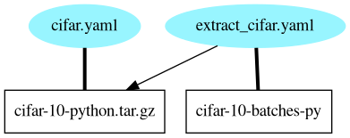

# Dud

Dud is a tool for storing, versioning, and reproducing large files alongside
source code.

## A quick walkthrough of Dud

Create a project.
```
$ mkdir cifar; cd cifar

$ dud init
Initialized .dud directory
```

Add some data and tell Dud to track it.
```
$ curl -O https://www.cs.toronto.edu/~kriz/cifar-10-python.tar.gz

$ dud stage new -o cifar-10-python.tar.gz | tee cifar.yaml
working-dir: .
outputs:
    - path: cifar-10-python.tar.gz

$ dud stage add cifar.yaml

$ dud status
cifar.yaml  (lock file up-to-date: false)
  cifar-10-python.tar.gz  uncommitted
```

Commit the data to the Dud cache.
```
$ dud commit
committing stage cifar.yaml

$ dud status
cifar.yaml  (lock file up-to-date: true)
  cifar-10-python.tar.gz  up-to-date (link)

$ ls -l
total 12
lrwxrwxrwx 1 user user  93 Oct 23 16:34 cifar-10-python.tar.gz ->
/home/user/cifar/.dud/cache/fe/3d11c475ae0f6fec91f3cf42f9c69e87dc32ec6b44a83f8b22544666e25eea
-rw-r--r-- 1 user user  59 Oct 23 16:32 cifar.yaml
-rw-r--r-- 1 user user 140 Oct 23 16:34 cifar.yaml.lock
```

Add a stage to extract the data.
```
$ mkdir cifar-10-batches-py

$ dud stage new -d cifar-10-python.tar.gz -o cifar-10-batches-py -- \
  tar -xf cifar-10-python.tar.gz | tee extract_cifar.yaml
command: tar -xf cifar-10-python.tar.gz
working-dir: .
dependencies:
    - path: cifar-10-python.tar.gz
outputs:
    - path: cifar-10-batches-py
      is-dir: true

$ dud stage add extract_cifar.yaml
```

Run the pipeline and commit the results.
```
$ dud run
nothing to do for stage cifar.yaml
running stage extract_cifar.yaml

$ dud status
cifar.yaml  (lock file up-to-date: true)
  cifar-10-python.tar.gz  up-to-date (link)
extract_cifar.yaml  (lock file up-to-date: false)
  cifar-10-batches-py  uncommitted

$ dud commit
committing stage cifar.yaml
committing stage extract_cifar.yaml

$ dud status
cifar.yaml  (lock file up-to-date: true)
  cifar-10-python.tar.gz  up-to-date (link)
extract_cifar.yaml  (lock file up-to-date: true)
  cifar-10-batches-py  up-to-date
```

Visualize the pipeline.
```
$ dud graph | dot -Tpng -o dud.png
```




## Design Principles

Dud aims to be simple, fast, and transparent.

### Simple

Dud should do one thing well and be a good UNIX citizen.

Dud should never get in your way (unless you're about to do something stupid).

Dud should strive to be stateless.

### Fast

Dud should prioritize speed while maintaining sensible assurances of data
integrity.

Dud should isolate time-intensive operations to keep the majority of the UX
as fast as possible.

Dud should scale to datasets in the hundreds of gigabytes and/or millions of
files.

### Transparent

Dud should explain itself early and often.

Dud should maintain its state in a human-readable (and ideally human-editable)
form.


## Terminology

### Artifact

An Artifact is a file or directory that is tracked by Dud. Artifacts are usually
stored in the Cache, but it isn't strictly necessary.

### Stage

A Stage is a group of Artifacts, or an operation that consumes and/or produces
a group Artifacts. Stages are defined by the user in YAML files and should be
tracked with source control.

### Index

The Index is the comprehensive group of Stages in a project. The Index forms
a dependency graph of Stages, enabling the user to define data pipelines.

### Cache

The Cache is a local directory where Dud stores and versions Artifacts. The
Cache is content-addressed, which (among other things) facilitates storing all
versions of all Artifacts without conflicts.
